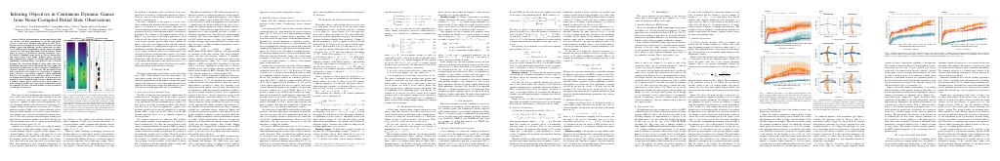

# PartiallyObservedInverseGames.jl


[](https://codecov.io/gh/PRBonn/PartiallyObservedInverseGames.jl)

An inverse game solver for inferring objectives from noise-corrupted partial
state observations of non-cooperative multi-agent interactions.

## Paper

[](https://arxiv.org/abs/2106.03611)

```latex
@inproceedings{peters2021rss,
    title     = {Inferring Objectives in Continuous Dynamic Games from Noise-Corrupted Partial State Observations},
    author    = {Peters, Lasse and Fridovich-Keil, David and Rubies-Royo, Vicen\c{c} and Tomlin, Claire J. and Stachniss, Cyrill},
    booktitle = {Proc.~of Robotics: Science and Systems (RSS)},
    year      = {2021},
    codeurl   = {https://github.com/PRBonn/PartiallyObservedInverseGames.jl},
    videourl  = {https://www.youtube.com/watch?v=BogCsYQX9Pc},
    url       = {https://arxiv.org/abs/2106.03611}
}
```

## Setup

This code was tested with Julia versions 1.5 and 1.6.

### Basic

Clone this reposistory
```
git clone https://github.com/PRBonn/PartiallyObservedInverseGames.jl
```

After you have cloned the repository, you can install all dependencies at the
versions recorded in the `Manifest.toml`:

1. Navigate to the installation directory, e.g. `cd ~/.julia/dev/PartiallyObservedInverseGames`
2. Start Julia in project mode: `julia --project`
3. Hit `]` to enter package mode and run: `pkg> instantiate`

Finally, you can run the unit tests via `] test` to confirm that the setup was
successful. Now you are ready to use the package. See [Directory
Layout](#directory-layout) for further details.

### Binary Data Version Control

Beyond that, we use [DVC](https://dvc.org) for binary data version control.
This part of the setup is only required if you want to load our results as
binary data rather than reproducing them yourself by re-running the
experiments. DVC can be installed as follow:

1. Install [dvc](https://dvc.org/doc/install) with http support, e.g. `pip install "dvc[http]"`
2. [Optional] Setup [git
   hooks](https://dvc.org/doc/command-reference/install#installed-git-hooks) to
   automate the process of checking out dvc-controlled files: `dvc install`

Now you can download the binary data and figures by running `dvc pull`.

## Directory Layout

- `src/` contains the implementations of our method and the baseline for
  inverse planning. Beyond that it contains implementations of forward game
  solvers and visualization utilities.

- `test/` contains unit and integration tests for the code in `src/`

- `experiments/` contains the code for reproducing the Monte Carlo study for
  the running example (`experiments/unicycle.jl`) and the highway overtaking
  scenario (`experiments/highway.jl`).

- After setting up `dvc` as described above and running `dvc pull` the
  directory `data/` contains the binary data of our results (as `.bson` file)
  as well as their visualization (as `.pdf` file).

## Reproducing Results

The results of the Monte Carlo study can be reproduced by running the
corresponding scripts in `experiments/`:

- 2-Player running example of collision avoidance: `experiments/unicycle.jl`
- 5-Player highway overtaking scenario: `experiments/highway.jl`

### Caching

The scripts located in `experiments/` will check for cached results in `data/`.
If cached results are found, they will be loaded and the figures will be
reproduced from this data. In order to reproduce results from scratch you will
have to clear the cache first by calling `clear_cache!()` (implemented in
`experiments/utils/simple_caching.jl`). Alternatively, you can remove the
`@run_cached`  macro in front the function calls in the experiment to disable
caching for that call.

### Distributed Experiments

Running a large scale Monte Carlo study can take a substantial amount of time.
Thus, this package uses
[`Distributed.jl`](https://docs.julialang.org/en/v1/stdlib/Distributed/) for
parallelization. If there are multiple workers registered in the worker pool,
the experiment scripts will automatically parallelize since all
heavy lifting is implemented using
[`Distributed.pmap`](https://docs.julialang.org/en/v1/stdlib/Distributed/#Distributed.pmap).
Workers can run on the same machine, on a remote cluster, or even both. The
only requirement is that all code can be loaded on the remote worker. This can
be achieved by mounting the repository to a shared directory that is available
from all nodes in the (potentially heterogeneous) cluster or by utilizing
`rsync`. A suit of useful utility functions for this task can also be found in
[Distributor.jl](https://github.com/lassepe/Distributor.jl).
